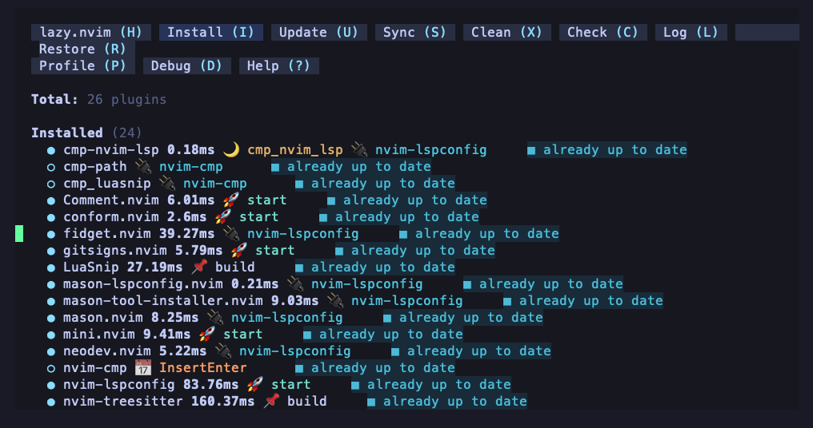
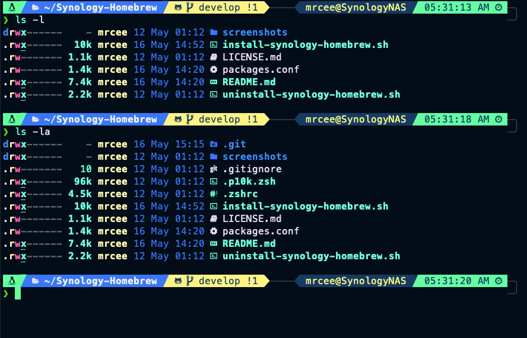

# Synology-Homebrew + Neovim!

## Introduction

Simplify the installation of Homebrew on Synology NAS devices running DSM 7.2 or later with this script. Our repository streamlines the process, ensuring comprehensive coverage of available packages for macOS/Linux on your Synology NAS.

## Why Homebrew on Synology NAS?

Homebrew, a package manager for macOS and Linux, unlocks a vast ecosystem of modern software and libraries for your Synology NAS. Dive into the richer features as mentioned below...

## Key Features

- **Simplified Setup:** Prepares your Synology NAS for Homebrew installation.
- **Comprehensive Package Management:** Installs essential components like glibc, gcc, Perl, oh-my-zsh, and more, mirroring the functionality of Homebrew on macOS 
- **Optimized Configuration:** Configures the Synology default ash/sh profile and newly installed zsh, enhancing your setup for efficiency.
- **Synology Integration:** Resolves conflicts with existing Synology packages, ensuring smooth operation.
- **Easy Uninstall:** Revert to the original state with the included uninstall script.

## Prerequisites

- Synology NAS running DSM 7.2 or later
- SSH access to the NAS
- User homes enabled
- Git is required for the installation process and can be installed via the Package Center Manager from [SynoCommunity](https://synocommunity.com). Git will be upgraded and older versions uninstalled after Homebrew installation is complete.
- A scheduled task to ensure Homebrew is mounted after each restart. Instructions provided below.
- iTerm2 running on your local machine with compatible nerdfonts and a theme to make it look great.

## Installation

**Download and Run in one command**: SSH into your Synology NAS running DSM 7.2 or above, and copy/paste the following command to download into your home directory and automatically execute the script.

```bash
git clone https://github.com/MrCee/Synology-Homebrew.git ~/Synology-Homebrew && \
~/Synology-Homebrew/install-synology-homebrew.sh
```

Select your install type:

##### 1) Synology-Homebrew: Minimal install will provide the homebrew basics, ignore packages in config.json, leaving the rest to you.
   ** If you are running this script after a full setup, you can use this option to uninstall packages previously installed by option 2

##### 2) Synology-Homebrew: Full setup includes packages in config.json
   ** This is recommended if you want to get started with Neovim

Essential packages that will always be installed include:

git, ruby, glibc, gcc, clang-build-analyzer (which includes latest python), zsh, oh-my-zsh.

## Configuration (config.json)

To manage packages, plugins, and themes, edit the `config.json` file and set the install flag to one of three options: **true**, **false**, or **skip**.

- **true**: Install the package, plugin, or theme.
- **false**: Uninstall the package, plugin, or theme.
- **skip**: Do nothing, leaving the current state unchanged.

If you don't want to install or uninstall a specific package, plugin, or theme, set the install flag to **skip**.

Plugins and themes can be defined under the **plugins** section. During script processing, `config.json` will be updated to use the last part of the URL as the plugin name, ensuring consistency in the install log and further processing.

Additionally, you can define **aliases** and **eval** commands across all `config.json` entries, which will be reflected in `~/.zshrc`.

### **config.json example**

The script will attempt to fix formatting errors and validate `config.json` providing a response to stdout if error is detected. The below is a snippet of how config.json should be formatted. Please see the file downloaded from this repository for the full scope.

```json
{
  "packages": {
    "neovim": {
      "install": true,
      "aliases": {
        "vim": "nvim"
      },
      "eval": ""
    },
    "stow": {
      "install": "skip",
      "aliases": "",
      "eval": ""
    },
     "bat": {
      "install": true,
      "aliases": {
        "cat": "bat --paging=never"
      },
      "eval": ""
    },
    "eza": {
      "install": true,
      "aliases": {
        "ls": "eza --color=always --group-directories-first --icons",
        "ll": "eza -la --icons --octal-permissions --group-directories-first --icons",
        "l": "eza -bGF --header --git --color=always --group-directories-first --icons",
        "llm": "eza -lbGd --header --git --sort=modified --color=always --group-directories-first --icons",
        "la": "eza --long --all --group --group-directories-first",
        "lx": "eza -lbhHigUmuSa@ --time-style=long-iso --git --color-scale --color=always --group-directories-first --icons",
        "lS": "eza -1 --color=always --group-directories-first --icons",
        "lt": "eza --tree --level=2 --color=always --group-directories-first --icons",
        "l.": "eza -a | grep -E '^\\.'"
      },
      "eval": ""
    },
    "thefuck": {
      "install": true,
      "aliases": "",
      "eval": "thefuck --alias"
    }
  },
  "plugins": {
    "powerlevel10k": {
      "install": true,
      "url": "https://github.com/romkatv/powerlevel10k",
      "directory": "~/.oh-my-zsh/custom/themes/powerlevel10k",
      "aliases": "",
      "eval": ""
    },
    "kickstart.nvim": {
      "install": true,
      "url": "https://github.com/nvim-lua/kickstart.nvim",
      "directory": "~/.config/nvim-kickstart",
      "aliases": {
        "nvim": "NVIM_APPNAME=\"nvim-kickstart\" nvim"
      },
      "eval": ""
    }
  }
}
```

## Installed packages

Modify packages to be installed by editing config.json and setting the install flag to true, false, or skip.

| Package                                                                         | Description                                                                                                 | Dependency                              |
| ------------------------------------------------------------------------------- | ----------------------------------------------------------------------------------------------------------- | --------------------------------------- |
| [brew](https://brew.sh)                                                         | Homebrew - The Missing Package Manager now for MacOS & Linux.                                               | Essential for: Synology-Homebrew        |
| [git](https://git-scm.com)                                                      | Latest version replaces Synology Package Centre version.                                                    | Essential for: Synology-Homebrew        |
| [ruby](https://www.ruby-lang.org)                                               | Latest version replaces Synology Package Centre version.                                                    | Essential for: Synology-Homebrew        |
| [zsh](https://www.zsh.org)                                                      | UNIX shell (command interpreter).                                                                           | Essential for: Synology-Homebrew        |
| [python3 / pip3](https://www.python.org)                                        | Installed with clang-build-analyzer. Latest version 3.12.3                                                  | Essential for: Synology-Homebrew        |
| [glibc](https://www.gnu.org/software/libc)                                      | The GNU C Library - The project provides the core libraries for the GNU system.                             | Essential for: Synology-Homebrew        |
| [gcc](https://gcc.gnu.org)                                                      | GNU compiler collection.                                                                                    | Essential for: Synology-Homebrew        |
| [clang](https://github.com/aras-p/ClangBuildAnalyzer)                           | installed with clang-build-analyzer containing many essential tools.                                        | Essential for: Synology-Homebrew        |
| [oh-my-zsh](https://ohmyz.sh)                                                   | Oh My Zsh is a delightful, open source, community-driven framework for managing your Zsh configuration.     | Essential for: Synology-Homebrew, zsh   |
| [make](https://www.gnu.org/software/make)                                       | Utility for directing compilation.                                                                          | Essential for: neovim plugins           |
| [node](https://nodejs.org)                                                      | JavaScript runtime environment.                                                                             | Essential for: neovim                   |
| [neovim](https://neovim.io)                                                     | Hyperextensible Vim-based text editor.                                                                      | Recommended for: Synology               |
| [powerlevel10k](https://github.com/romkatv/powerlevel10k)                       | A theme for zsh.                                                                                            | Recommended for: oh-my-zsh              |
| [zsh-syntax-highlighting](https://github.com/zsh-users/zsh-syntax-highlighting) | A plugin for zsh.                                                                                           | Recommended for: oh-my-zsh              |
| [zsh-autosuggestions](https://github.com/zsh-users/zsh-autosuggestions)         | A plugin for zsh.                                                                                           | Recommended for: oh-my-zsh              |
| [ripgrep](https://github.com/BurntSushi/ripgrep)                                | Ripgrep is a line-oriented search tool that recursively searches the current directory for a regex pattern. | Essential for: neovim, telescope, fzf   |
| [fd](https://github.com/sharkdp/fd)                                             | Simple, fast and user-friendly alternative to find.                                                         | Essential for: neovim, telescope        |
| [fzf](https://github.com/junegunn/fzf)                                          | A command-line fuzzy finder.                                                                                | Essential for: neovim, telescope        |
| [fzf-git.sh](https://github.com/junegunn/fzf-git.sh)                            | Bash and zsh key bindings for Git objects.                                                                  | Recommended for: neovim, telescope, fzf |
| [bat](https://github.com/sharkdp/bat)                                           | A cat(1) clone with syntax highlighting and Git integration.                                                | Recommended for: neovim                 |
| [git-delta](https://github.com/dandavison/delta)                                | Language syntax highlighting for diff using a Levenshtein edit inference algorithm.                         | Recommended for: neovim                 |
| [eza](https://github.com/eza-community/eza.git)                                 | A modern, maintained replacement for the venerable file-listing command-line program ls                     | Recommended for: zsh, neovim            |
| [tldr](https://github.com/tldr-pages/tldr)                                      | The tldr-pages project is a collection of community-maintained help pages for command-line tools            | Recommended for: neovim                 |
| [thefuck](https://github.com/nvbn/thefuck)                                      | A magnificent app that corrects errors in previous console command.                                         | Recommended for: zsh                    |
| [kickstart.nvim](https://github.com/nvim-lua/kickstart.nvim)                    | A starting point for Neovim.                                                                                | Optional for: neovim                    |
| [perl](https://www.perl.org)                                                    | Highly capable, feature-rich programming language.                                                          | Essential for: stow                     |
| [stow](https://www.gnu.org/software/stow)                                       | GNU Stow: Organize software neatly under a single directory tree.                                           | Optional                                |
| [zoxide](https://github.com/ajeetdsouza/zoxide)                                 | Zoxide is a smarter cd command, inspired by z and autojump                                                  | Recommended for: zsh                    |

For a full list of dependancies installed, run: `brew deps --installed` after installation.

## Neovim

Neovim (nvim) is ready to go with essential requirements configured within a separate file `nvim_config.sh` in which you can run indepenently to enable clipboard and further required files.
This includes:

- Enable clipboard over SSH using OSC52 for all nvim configurations stored or symlinked in `~/.config`.
- Linting Python with `pip3 install pynvim`.
- Updating outdated gems.
- Installing neovim gem.
- Adding fzf-git.sh with Git key bindings to `~/.scripts` directory.

### Kickstart Neovim with Lazy (optional)

In the plugins section of `config.json`, set `kickstart.nvim` to true to install and configure Neovim with kickstart.nvim. This provides a lazy configuration with everything working out of the box. It will be installed to the specified directory in config.json with a backup of any existing config to your home folder.

To switch between Neovim configurations easily, use aliases in `~/.zshrc`:

```zsh
alias nvim='NVIM_APPNAME="nvim-kickstart" nvim' # Aliases ~/.config/nvim-kickstart
alias nvim # Shows current nvim command alias
unalias nvim # Removes previous alias
alias nvim='NVIM_APPNAME="your-custom-nvim-directory" nvim' # Aliases ~/.config/your-custom-nvim-directory
```

See kickstart.nvim provided in the [config.json example](#configjson-example) above.

If no alias is set, Neovim will attempt to use the default nvim config location `~/.config/nvim`

Run :checkhealth in Neovim after installation to see more detail about any further plugins you may need.



## Customizing Your zsh

The Synology-Homebrew + Neovim setup comes pre-configured with a sleek Zsh theme and several useful plugins to enhance your command-line experience. Customize your zsh with ease using the `p10k configure` command and enjoy a fully tailored terminal environment.



## Synology Task Scheduler to Persist Installation after Restart

We need to ensure the Homebrew directory is mounted after each restart. Add the following to Synology Task Scheduler:

1. Triggered Task | User-defined script
   - Task name: Homebrew Boot
   - User: root
   - Event: Boot-up
   - Enabled: True
   - Task Settings | Run Command:

```bash
#!/bin/bash
[[ ! -d /home ]] && mkdir /home
mount -o bind "/volume1/homes" /home
```

## Usage and Contributions

Refer to Homebrew documentation for usage instructions. Contributions are welcome! Open an issue or submit a pull request on GitHub for feedback or suggestions.

## Disclaimer and License

This script is provided as-is without any warranty. Review and understand the script's changes to your system before running it. This project is licensed under the MIT License.

## Acknowledgements

Thanks to the many people and teams that contribute to the packages installed by this script, the GitHub & Synology community, and some of the best on youtube. @ogerardin, @AppleBoiy, @josean-dev, @tjdevries.

<a href="https://www.buymeacoffee.com/MrCee" target="_blank">
    
</a>
