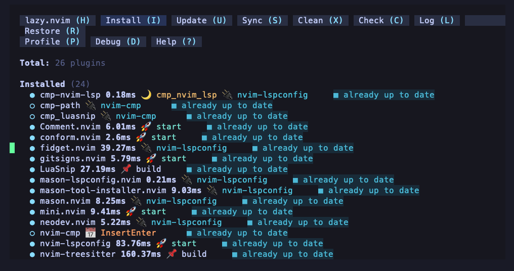
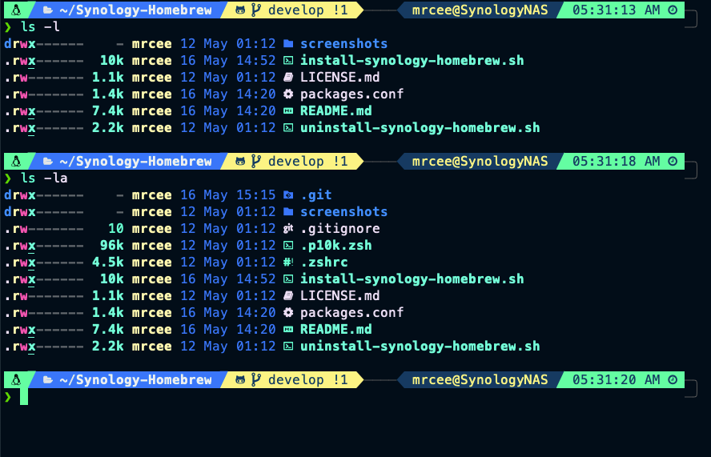

# Synology-Homebrew

[](https://opensource.org/licenses/MIT)
[](https://github.com/MrCee/Synology-Homebrew/pulls)
[](https://github.com/MrCee/Synology-Homebrew/commits)
[](https://www.synology.com/en-global/dsm)
[](https://en.wikipedia.org/wiki/X86-64)

---

### 🚀 Overview

**Synology-Homebrew** provides a safe, repeatable way to install and manage Homebrew on **Synology DSM** and **macOS**, with two modes:

- **Minimal**: a clean base install of Homebrew + essentials  
- **Advanced**: drive everything from a `config.yaml` (packages, plugins, aliases)

It respects your Synology environment, avoids overwriting system packages, and includes a full uninstall path.

*macOS support exists to allow the same `config.yaml` used on a Synology NAS to be applied consistently on a Mac (for development, replication, or local tooling parity).*

---

## 🔥 What’s New Jan 2026

**Expanded DSM compatibility with explicit platform safeguards**  

DSM 7.1 is supported on a best-effort basis.  
32-bit platforms are not supported by Homebrew and are blocked by the installer.

Because DSM 7.1 can run on unsupported 32-bit platforms, the installer performs upfront CPU architecture validation to prevent silent Homebrew installer failures.

---

## ⚙️ Installation Guide

### 🚀 Quick Start (Synology NAS)

1. SSH into DSM 7.2+  
2. Clone & run the installer:

```zsh
git clone https://github.com/MrCee/Synology-Homebrew.git ~/Synology-Homebrew && \
~/Synology-Homebrew/install-synology-homebrew.sh
```

Choose **1 = Minimal** or **2 = Advanced** when prompted.

---

### 💻 Quick Start (macOS)

```zsh
git clone https://github.com/MrCee/Synology-Homebrew.git ~/Synology-Homebrew && \
~/Synology-Homebrew/install-synology-homebrew.sh
```

- On Intel Macs, Homebrew installs to `/usr/local`  
- On Apple Silicon Macs, Homebrew installs to `/opt/homebrew`  
- The installer adds `brew shellenv` to your `~/.zprofile` so Homebrew is always on your PATH  

---

## 🧼 Option 1: Minimal Install (Clean & Lightweight)

- Installs **Homebrew + essentials** only (platform-specific baseline)  
- Offers a **prune** prompt at the end (optional) to remove extras you installed previously  

### Minimal baselines

- **Synology/Linux baseline**  
  `binutils glibc gcc git ruby python3 zsh yq`

- **macOS baseline**  
  `git yq ruby python3 coreutils findutils gnu-sed grep gawk`  

---

## ⚡ Option 2: Advanced Install (Fully Loaded)

- Parses **`config.yaml`** and applies your declared actions:  
  - `install` → install package/plugin  
  - `uninstall` → remove it  
  - `skip` → do nothing  
- Adds aliases and `eval` lines to your `~/.zshrc`, but only for packages you’ve chosen to keep  
- Invokes optional Neovim bootstrap and Zsh configuration helpers when flagged in YAML  

**File location:**
```zsh
~/Synology-Homebrew/config.yaml
```

**Edit with your preferred editor:**

```zsh
nvim ~/Synology-Homebrew/config.yaml
# or
nano ~/Synology-Homebrew/config.yaml
```

**Example (excerpt):**
```yaml
packages:
  neovim:
    action: install
    aliases:
      vim: "nvim"
    eval: []

  bat:
    action: install
    aliases:
      cat: "bat --paging=never"
    eval: []

plugins:
  powerlevel10k:
    action: install
    url: "https://github.com/romkatv/powerlevel10k"
    directory: "~/.oh-my-zsh/custom/themes/powerlevel10k"
    aliases: []
    eval: []

  mrcee.nvim:
    action: install
    url: "REPLACE_THIS_WITH_MY_PUBLIC_NVIM_REPO_URL"
    directory: "~/.config/nvim"
    aliases:
      nvim: "nvim"
    eval: []
```

---

## 🍃 Minimal “Prune” (What it does and doesn’t do)

At the end of **Minimal mode**:

- The script computes **extras** by comparing your **explicitly installed leaf formulas** (`brew leaves`) with the **minimal baseline** for your platform.  
- It **offers** to uninstall those extras.  
- It **does not** remove dependencies required by remaining formulas or by Homebrew itself.  

This keeps pruning **safe** and predictable.

---

## 🧱 Synology Notes

- `/home` is bind-mounted from `/var/services/homes`
- Permissions are repaired defensively
- Homebrew is isolated from Synology system packages
- No permanent DSM modifications are required

**Suggested boot task (User-defined Script):**
```bash
#!/bin/bash
[[ ! -d /home ]] && sudo mkdir /home
if ! grep -qs ' /home ' /proc/mounts; then
  sudo mount -o bind "$(readlink -f /var/services/homes)" /home
fi
sudo chown root:root /home && sudo chmod 775 /home
if [[ -d /home/linuxbrew ]]; then
  sudo chown root:root /home/linuxbrew && sudo chmod 775 /home/linuxbrew
fi
```

---

## 🍎 macOS Notes

- Homebrew installs to `/opt/homebrew` on Apple Silicon, and `/usr/local` on Intel  
- The installer updates your `~/.zprofile` with `brew shellenv`  
- Since macOS already includes zsh, the script does not install it  

---

## 🧪 Neovim (optional)

You can bootstrap Neovim via **Advanced** mode. The canonical Neovim configuration
comes from:

```zsh
REPLACE_THIS_WITH_MY_PUBLIC_NVIM_REPO_URL
```

The installer follows the old “use it if it is empty” rule:

- If `~/.config/nvim` is absent or empty, the public repo is cloned there and
  `nvim` uses it normally.
- If `~/.config/nvim` is already a git checkout of the canonical repo, the
  installer updates it with `git pull --ff-only`.
- If `~/.config/nvim` contains an existing user config, it is left untouched and
  the public config is cloned to `~/.config/nvim-mrcee` instead.

When the fallback path is used, Advanced mode writes this alias to `~/.zshrc`:

```zsh
alias nvim='NVIM_APPNAME="nvim-mrcee" nvim'
```

That alias is what makes the public config the default `nvim` experience for
interactive shells when the default config directory was already occupied.

Inside Neovim, run:
```vim
:checkhealth
```



---

## 🖌️ Customize Your Zsh

Your shell environment comes preloaded with:

- `zsh` + `oh-my-zsh`  
- The `powerlevel10k` theme  
- Helpful plugins (such as autosuggestions and syntax highlighting)  
- Useful command aliases (`ll`, `vim → nvim`, `cat → bat`, `cd → zoxide`, `ls → eza`)



---

## 📦 Installed Packages (Advanced)

When you select **Advanced Install**, the script installs everything defined in `config.yaml`.  
Below is the full curated list — collapsed for readability, but fully indexed.

## 📋 Full Package List

| Package | Description | Dependency |
|---------|-------------|------------|
| [jq](https://jqlang.github.io/jq) | Lightweight and flexible command-line JSON processor. | Essential for: Synology-Homebrew |
| [node](https://nodejs.org) | JavaScript runtime environment. | Essential for: neovim |
| [neovim](https://neovim.io) | Hyperextensible Vim-based text editor. | Recommended for: Synology |
| [powerlevel10k](https://github.com/romkatv/powerlevel10k) | A theme for zsh. | Recommended for: oh-my-zsh |
| [zsh-syntax-highlighting](https://github.com/zsh-users/zsh-syntax-highlighting) | A plugin for zsh. | Recommended for: oh-my-zsh |
| [zsh-autosuggestions](https://github.com/zsh-users/zsh-autosuggestions) | A plugin for zsh. | Recommended for: oh-my-zsh |
| [ripgrep](https://github.com/BurntSushi/ripgrep) | Recursive regex directory search tool. | Essential for: neovim, telescope, fzf |
| [fd](https://github.com/sharkdp/fd) | User-friendly alternative to `find`. | Essential for: neovim, telescope |
| [fzf](https://github.com/junegunn/fzf) | A command-line fuzzy finder. | Essential for: neovim, telescope |
| [fzf-git.sh](https://github.com/junegunn/fzf-git.sh) | Bash and zsh key bindings for Git objects. | Recommended for: neovim, telescope, fzf |
| [bat](https://github.com/sharkdp/bat) | A `cat` clone with syntax highlighting and Git integration. | Recommended for: zsh, neovim |
| [git-delta](https://github.com/dandavison/delta) | Syntax highlighting for diffs using Levenshtein algorithm. | Recommended for: neovim |
| [eza](https://github.com/eza-community/eza.git) | A modern replacement for `ls`. | Recommended for: zsh, neovim |
| [tldr](https://github.com/tldr-pages/tldr) | Simplified help pages for command-line tools. | Recommended for: neovim |
| [thefuck](https://github.com/nvbn/thefuck) | Corrects previous console command errors. | Recommended for: zsh |
| [mrcee.nvim](REPLACE_THIS_WITH_MY_PUBLIC_NVIM_REPO_URL) | Canonical public Neovim configuration. | Optional for: neovim |
| [perl](https://www.perl.org) | Feature-rich programming language. | Essential for: stow |
| [stow](https://www.gnu.org/software/stow) | GNU Stow: Manage symlinks for dotfiles. | Optional |
| [zoxide](https://github.com/ajeetdsouza/zoxide) | Smarter `cd` command, inspired by `z` and `autojump`. | Recommended for: zsh |
| [lazygit](https://github.com/jesseduffield/lazygit) | Terminal UI for Git commands. | Recommended for: zsh, neovim |

---

## 🧩 Compatibility & Platform Support

### Architectures

| Architecture | Status |
|-------------|--------|
| x86_64 | ✅ Supported |
| ARM64 (aarch64) | ✅ Supported |
| ARMv7 / ARMv6 | ❌ Unsupported |

32-bit ARM systems are blocked early to prevent silent Homebrew installer failures.

### DSM Versions

| DSM Version | Status |
|------------|--------|
| DSM 7.2+ | ✅ Fully supported |
| DSM 7.1 | ⚠️ Best-effort |
| DSM < 7.1 | ❌ Unsupported |

---

## 🛡️ Security & Safety

- No hidden network calls beyond Homebrew itself  
- No credentials or sudo passwords are logged  
- Sudoers fragments are created + removed automatically at the end of a run  
- Full uninstall path is included  
- 100% open-source and auditable  

---

## 📥 Install Git (DSM) if missing

```bash
curl -sSL https://raw.githubusercontent.com/MrCee/Synology-Git/refs/heads/main/install-synology-git.sh | bash
```

---

## ⚖️ License

This project is licensed under the [MIT License](./LICENSE).

---

## ☕ Buy Me a Coffee

<p align="left">
  <a href="https://www.buymeacoffee.com/MrCee" target="_blank" rel="noopener">
    
  </a>
</p>

If this script saved your bacon, rescued your dotfiles, or spared you from another SSH debugging spiral — legend.  
Buy me a coffee (flat white, long black, or whatever keeps the terminal open) and I’ll keep shipping fixes, features, and fewer headaches.
